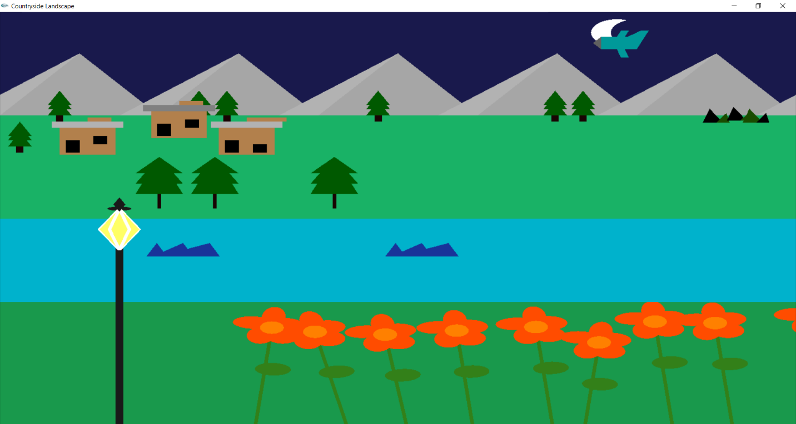

# cpp-opengl-countryside-landscape
### This is "Computer Graphics" course group project of [AIUB](https://www.aiub.edu/). There are 4 group members.
  1. Haque, Afrin
  2. Khan, Sakil
  3. Nirzon, Md. Ahafid Zaman
  4. Barman, Prosenjite
  ### Features:
    A countryside view has been be drawn with rivers, mountains and sky. The project displays a rural landscape in both 
    day and night time. Children playing in the     background will be created in the scene. The project features include: 
    • Moving boats 
    • Moving clouds 
    • Moving plane
    • Moving wave
    • Fish jumping 
    • Children playing in background (jumping) 
    • Flowers rotating due to wind
    • Grass
    • Day view
    • Night view
### Screenshot Of This Project:

##### Fig 1: Day View

##### Fig 2: Night View
### Using Technology:

##### Using Programming Language and Libraries:
- C++
- Libraries of C++ OpenGL.
##### We have used following header files:
    • #include<cstdio>
    • #include<iostream>
    • using namespace std;
    • #include<math.h>
    • #include <GL/gl.h>
    • #include <GL/glut.h>
##### Some of the functions used in our project:
    • glutTimerFunc()
    • handleMouse()
    • handleKeypress()
    • Setcolor function:
    • glPushMatrix()
    • glPopMatrix()
    • glRotatef()
##### Primitives used in the project:
    • GL_TRIANGLES
    • GL_TRIANGLE_FAN
    • GL_LINES
    • GL_LINE_LOOP
    • GL_QUADS
